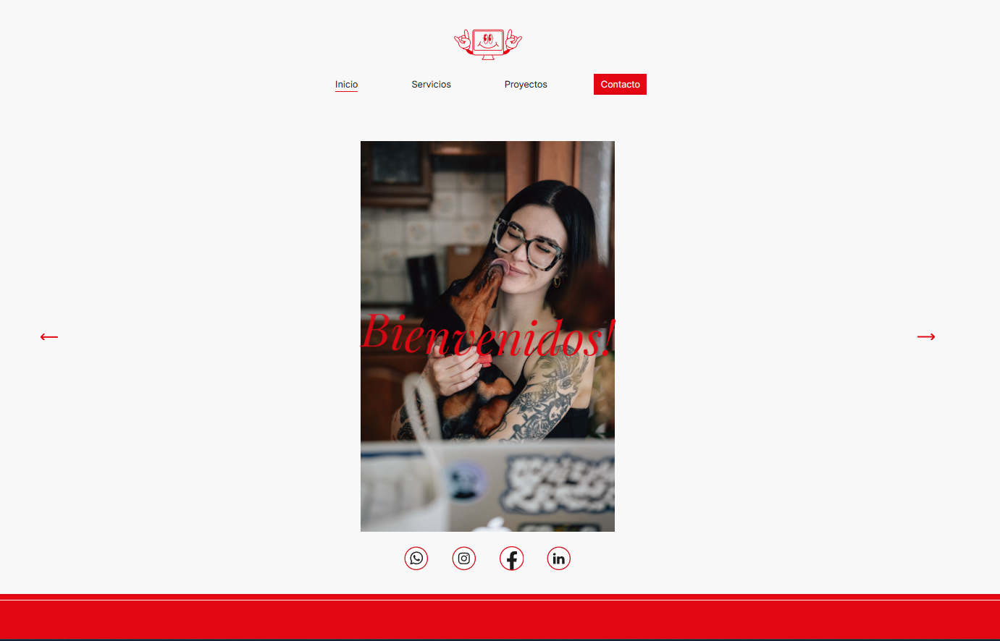

# 🌸 By Carla Herrero

  
  
  
  
  
  
  

---

## 📖 Project Overview

**By Carla Herrero** is a full-stack web application developed for a **marketing
agency**.  
The agency offers services such as **social media management**, **web
prototyping**, **artistic creation**, and more.

The website highlights the agency’s **portfolio of projects**, where clients and
completed works are showcased.  
To make this process dynamic, the backend allows the client to **self-manage
their portfolio**, adding new projects with images, titles, texts, and other
details.

The project is composed of a **ReactJS Frontend** and a **Node.js + Express
Backend**, bundled with **Vite**.

---

## 🚀 Features

- ✨ **Frontend** built with ReactJS and native CSS.
- ⚙️ **Backend** built with Node.js and Express, supporting **portfolio
  self-management**.
- 🖼️ **Dynamic portfolio**: Add, edit, and manage projects (clients and works
  completed).
- 🔑 **Admin access** protected by a simple username and password.
- 📱 **Responsive design**: Adapted from an initial client-provided design,
  redesigned with **Figma**.
- 🔄 **Hooks & Reusability**: Strong usage of React hooks (`useState`,
  `useEffect`, `useRef`) and **custom hooks**.
- 🌐 **Libraries**:
  - **React Router DOM** for dynamic navigation.
  - **Axios** for handling requests.
  - **React CountUp** for animated counters.
  - **React Intersection Observer** for smooth animations.

---

## 🌐 Live Demo

🔗 [by Carla Herrero Web](https://bycarlaherrero.com/)

---

## 📸 Screenshots

  

---

## 🛠️ Tech Stack

- **Frontend**: ReactJS, CSS, Vite
- **Backend**: Node.js, Express
- **Libraries & Tools**: Axios, React Router DOM, React CountUp, React
  Intersection Observer
- **Design**: Figma

---

## 📚 What I Learned

This project helped me **deepen my understanding of React Router DOM** and the
importance of reusable component architecture.  
I also practiced implementing **protected routes**, managing state with **custom
hooks**, and integrating libraries for smooth user experiences.

One of the biggest challenges was **deploying a full-stack app** (Node.js
backend + React frontend) on a hosting provider mainly designed for
**WordPress**. Overcoming this required research and adaptation, which gave me
valuable deployment and hosting experience.

---

## 📬 Contact

Let’s connect!

---
